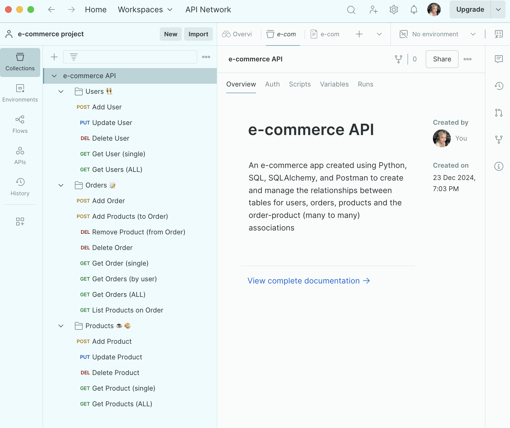
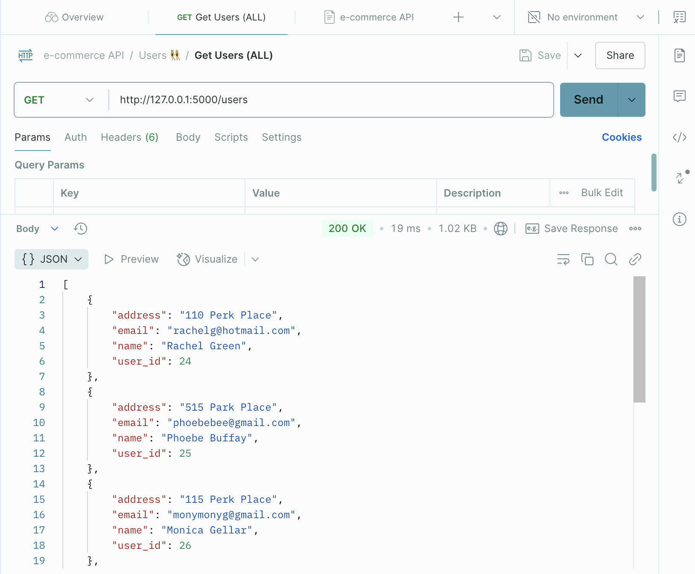
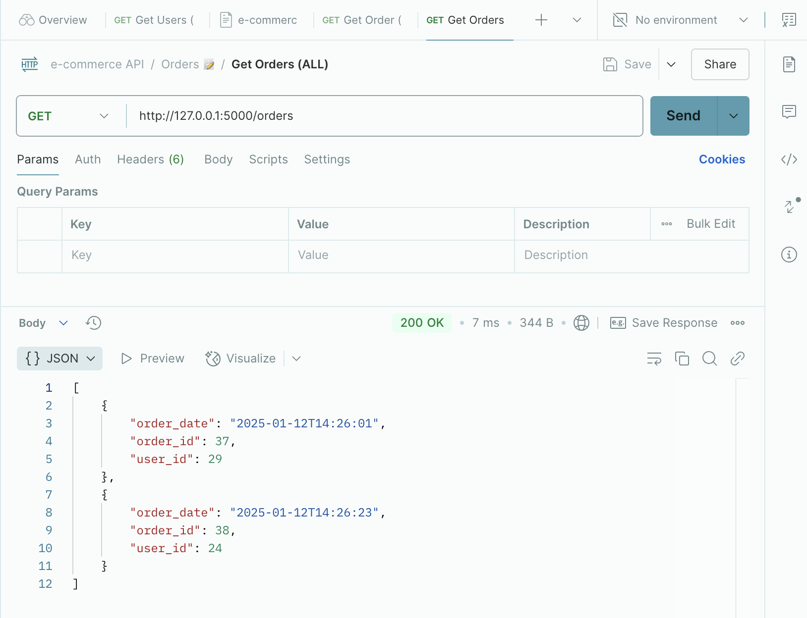

# E-Commerce API

## Status: Archived

This was a Module 3 project from my Coding Temple bootcamp. It's kept here for reference but is no longer maintained or updated.

## What This Was
A REST API for an e-commerce backend built with Flask, SQLAlchemy, and Marshmallow, connected to a MySQL database. Supports full CRUD on Users, Orders, and Products, plus relationship endpoints for adding/removing products from orders and querying orders by user or products by order.

It was designed to facilitate the online shopping experience at a coffee shop, and is loosely based on the 1990's - early 2000's sitcom, [FRIENDS](https://www.imdb.com/title/tt0108778/). 

## Features
- Users: add, modify, delete
- Orders: add, modify, delete
- Products: add, modify, delete
- Add/remove products from orders
- Reporting (GET requests) for all database tables

## Tech Used
Python, Flask, SQLAlchemy, Marshmallow, MySQL, Postman

## Why It's Archived
This was a bootcamp project demonstrating early REST API and ORM relationship design. My current Mechanic Shop API project covers the same core skills with authentication, testing, and CI/CD added. Kept here for reference only.

## API Screenshots
**Home Page**:

##

**GET** All Users:

##

**GET** All Orders:

##

**GET** All Products:

## Author
- GitHub: [@jenkauppila](https://github.com/jenkauppila)
- LinkedIn: [linkedin.com/in/jenkauppila](https://www.linkedin.com/in/jenkauppila)

## Acknowledgments
Thanks to classmates and instructors at Coding Temple for guidance and code review feedback during this project.
